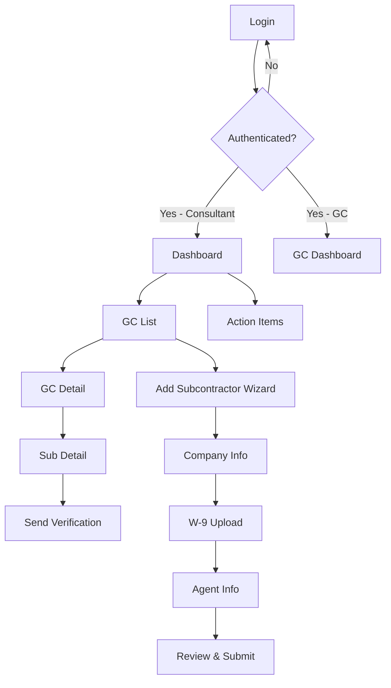
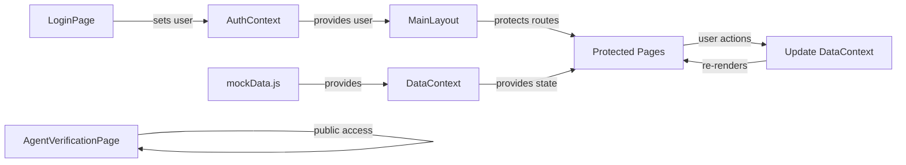

# CoverVerifi

[](https://acentralabs.com)

**CoverVerifi** is a lightweight insurance compliance platform for construction consultants who manage subcontractor insurance verification on behalf of general contractors. It automates the manual process of tracking policies, verifying coverage, and managing compliance across multiple contractors with a simple, intuitive interface.

## Table of Contents

- [Features](#features)
- [Getting Started](#getting-started)
- [Project Structure](#project-structure)
- [Tech Stack](#tech-stack)
- [Environment Variables](#environment-variables)
- [Deployment](#deployment)
- [Available Scripts](#available-scripts)
- [Architecture](#architecture)
- [Contributing](#contributing)
- [License](#license)

## Features

### Core MVP Features

✅ **Consultant Dashboard** – Single pane of glass showing all contractors, subcontractors, compliance status, and action items  
✅ **Contractor Management** – Add and manage multiple GC clients with their specific requirements  
✅ **Subcontractor Onboarding Wizard** – 4-step process to add subs with W-9 upload and insurance agent info  
✅ **Compliance Tracking** – Real-time RAG (Red/Amber/Green) status for workers' comp and general liability policies  
✅ **Insurance Agent Verification Portal** – Public-facing form for agents to confirm coverage without login  
✅ **Email Verification Workflow** – Send verification requests to agents with pre-built templates  
✅ **Multi-Tenant Authentication** – Role-based access for consultants and GC users  

### Future Phases

🔲 GC Self-Service Portal – Contractors add their own subcontractors  
🔲 W-9 PDF Parsing – Auto-extract company details from W-9 documents  
🔲 Document Management – Store and version COI certificates and agreements  
🔲 Advanced Reporting – Audit-ready compliance reports and export  
🔲 Payment Draw Verification – Bulk verify subs before payment release  

## Getting Started

### Prerequisites

- Node.js 18+ and npm
- Modern browser (Chrome, Firefox, Safari, Edge)
- (Optional for Phase 2) Supabase account for backend deployment

### Installation

```bash
# Clone or download the repository
cd coververifi

# Install dependencies
npm install

# Start development server
npm run dev
```

The app will open at `http://localhost:5173`

### Demo Credentials

**Consultant Account:**
- Email: `dawn@coververifi.com`
- Password: `password123`

**General Contractor Account:**
- Email: `john@mountainwest.com`
- Password: `gcpass123`

## Project Structure

```
coververifi/
├── src/
│   ├── main.jsx                    # React entry point
│   ├── App.jsx                     # Route configuration
│   ├── index.css                   # TailwindCSS imports
│   ├── contexts/
│   │   ├── AuthContext.jsx         # Authentication state (mock)
│   │   └── DataContext.jsx         # Application data state
│   ├── components/
│   │   ├── layout/
│   │   │   └── MainLayout.jsx      # Sidebar + header + footer wrapper
│   │   ├── ProtectedRoute.jsx      # Route guard component
│   │   └── RAGStatusBadge.jsx      # Reusable compliance status badge
│   ├── pages/
│   │   ├── LoginPage.jsx           # Email/password authentication
│   │   ├── DashboardPage.jsx       # Main consultant dashboard with KPIs
│   │   ├── GCListPage.jsx          # List all contractors
│   │   ├── GCDetailPage.jsx        # View contractor details and subs
│   │   ├── SubDetailPage.jsx       # View sub policies and verification
│   │   ├── SubOnboardingPage.jsx   # 4-step wizard to add subcontractors
│   │   └── AgentVerificationPage.jsx # Public agent verification form
│   └── data/
│       └── mockData.js             # Realistic mock data for all entities
├── supabase/
│   └── schema-stub.sql             # PostgreSQL schema for future deployment
├── docs/
│   ├── technical.md                # Architecture and data model docs
│   └── user-guide.md               # Non-technical user walkthrough
├── index.html                      # HTML entry point
├── vite.config.js                  # Vite configuration
├── vercel.json                     # Vercel deployment config
├── package.json                    # Dependencies and scripts
└── README.md                       # This file
```

## Tech Stack

| Layer | Technology | Version | Purpose |
|-------|-----------|---------|---------|
| **Frontend Framework** | React | 18.3 | Component-based UI with hooks |
| **Build Tool** | Vite | 5.0 | Fast development and production builds |
| **Styling** | TailwindCSS | 4.0 | Utility-first CSS with responsive design |
| **Routing** | React Router | 6.22 | Client-side navigation and protected routes |
| **Forms** | react-hook-form | 7.50 | Lightweight form state and validation |
| **State Management** | Zustand | 4.4 | Lightweight alternative to Redux |
| **Date Handling** | date-fns | 3.0 | Parse, format, and calculate dates |
| **Icons** | lucide-react | 0.344 | Consistent SVG icons |
| **UI Feedback** | react-hot-toast | 2.4 | Lightweight notifications and alerts |
| **Tables** | @tanstack/react-table | 8.17 | Headless table component |
| **Utilities** | clsx | 2.1 | Conditional className composition |
| **Authentication** | Mock (Supabase Auth ready) | — | Email/password with role-based access |
| **Database** | Mock (Supabase ready) | — | PostgreSQL with RLS policies |

## Environment Variables

For Phase 2 integration with a live backend, create a `.env.local` file:

```env
# Backend / Supabase Configuration
VITE_SUPABASE_URL=https://your-project.supabase.co
VITE_SUPABASE_ANON_KEY=your_anon_key_here

# Email Service (Resend or SendGrid)
VITE_RESEND_API_KEY=your_resend_key_here
VITE_SENDGRID_API_KEY=your_sendgrid_key_here

# Environment
VITE_ENV=development # or production
```

**Note:** MVP uses mock data and authentication. Backend integration is planned for Phase 2.

## Deployment

### Vercel (Recommended for SPA)

```bash
# Install Vercel CLI
npm i -g vercel

# Deploy
vercel --prod
```

Vercel will automatically:
- Build with `npm run build`
- Deploy the `dist/` folder
- Configure SPA rewrites (see `vercel.json`)
- Provide free HTTPS and auto-scaling

**Cost:** Free tier covers this app's usage.

### Other Platforms

**Netlify:**
```bash
npm install -g netlify-cli
netlify deploy --prod
```

**GitHub Pages (static):**
```bash
npm run build
# Push dist/ to gh-pages branch
```

## Available Scripts

```bash
# Development server (hot reload at http://localhost:5173)
npm run dev

# Production build (outputs to dist/)
npm run build

# Preview production build locally
npm run preview
```

## Architecture

### Page & Route Structure



### Data Flow



### Component Hierarchy

```
App
├── AuthProvider
│   └── DataProvider
│       ├── LoginPage
│       └── Protected Routes
│           ├── MainLayout
│           │   ├── Sidebar (navigation)
│           │   ├── Header
│           │   ├── Content Area
│           │   │   ├── DashboardPage
│           │   │   ├── GCListPage
│           │   │   ├── GCDetailPage
│           │   │   ├── SubDetailPage
│           │   │   └── SubOnboardingPage
│           │   └── Footer
└── AgentVerificationPage (public, no layout)
```

## Data Model

### Entities

**Consultants** – Platform users who manage multiple GCs
- id, email, fullName, companyName, createdAt, updatedAt

**General Contractors** – GC companies, owned by a consultant
- id, consultantId, companyName, contactEmail, contactPhone, glRequirement, wcRequirement, requireAdditionalInsured

**Subcontractors** – Shared across GCs
- id, companyName, phone, email, createdAt, updatedAt

**GC-Subcontractors** – Many-to-many linking
- id, gcId, subId, createdAt

**Insurance Policies** – WC and GL policies per sub
- id, subId, policyType, carrier, policyNumber, expirationDate, coverageLimit, agentId, status

**Insurance Agents** – Agent/agency contact info
- id, agentName, agencyName, phone, email

**Documents** – Uploaded COIs and W-9s
- id, subId, documentType, filePath, fileName, uploadedAt

**Verification Requests** – Email audit trail
- id, policyId, agentId, gcId, status, createdAt, respondedAt, response

**Email Templates** – Pre-built verification emails
- id, gcId, templateName, subject, body, mergeFields

## Key Workflows

### 1. Subcontractor Onboarding
1. Consultant clicks "Add Subcontractor"
2. Wizard walks through: company info → W-9 upload → agent contact info → review
3. On submit: Creates subcontractor, agents, policies, verification tokens
4. System sends (mocked) verification emails to WC and GL agents

### 2. Policy Verification
1. Agent receives email with tokenized link to verification portal
2. Portal shows policy details (no login required)
3. Agent confirms coverage status or uploads updated certificate
4. Response is recorded in verification_requests table

### 3. Compliance Dashboard
1. Consultant logs in → sees KPI cards (total GCs, subs, compliance %)
2. Action items sorted by severity (Red/Yellow/Green)
3. Click GC card → see all subs linked to that GC
4. Click sub → see all policies, send verification, view documents

## Security Considerations

- **Authentication:** Mock login in MVP; Phase 2 uses Supabase Auth with email/password and JWT tokens
- **Authorization:** Role-based access (consultant vs GC) enforced at component and database levels
- **Row-Level Security:** Supabase RLS policies ensure data isolation by tenant
- **HTTPS:** Enforced in production (Vercel auto-provides)
- **Sensitive Data:** Mock credentials in code are demo-only; production uses environment variables
- **CORS:** Supabase and Vercel configured for secure cross-origin requests

## Responsive Design

- **Mobile (<768px):** Single column, touch targets 44px+, stacked navigation
- **Tablet (768px-1280px):** Two-column layouts, cards in 2-col grid
- **Desktop (>1280px):** Three-column layouts, full-width tables

All breakpoints use TailwindCSS utilities: `sm`, `md`, `lg`, `xl`

## Performance

- **Bundle Size:** ~150KB gzipped (Vite optimized)
- **Time to Interactive:** <2s on 4G connection
- **Lighthouse Score:** Target 90+ on Performance, Accessibility, Best Practices
- **Caching:** Browser caches assets; no backend caching needed for MVP

## Browser Support

- Chrome/Edge 90+
- Firefox 88+
- Safari 14+
- Mobile browsers (iOS Safari 14+, Chrome Android)

## Contributing

### Branch Strategy
- `main` – Production-ready code
- `develop` – Integration branch for features
- `feature/*` – New features (branch from develop)
- `bugfix/*` – Bug fixes (branch from develop)

### PR Process
1. Create feature branch: `git checkout -b feature/your-feature`
2. Make changes and commit: `git commit -m "Clear commit message"`
3. Push to remote: `git push origin feature/your-feature`
4. Open PR against `develop` with description of changes
5. Address code review feedback
6. Merge when approved

### Code Style
- Use ESLint and Prettier (configured in project)
- Run `npm run lint` before committing
- Follow React hooks best practices (useCallback, useMemo for optimization)
- Keep components under 300 lines; extract subcomponents if larger

## License

This project is proprietary software developed for Acentra Labs and its clients. Unauthorized copying or distribution is prohibited.

## Support & Contact

For questions, issues, or feature requests, please reach out to **Acentra Labs**:
- Website: [acentralabs.com](https://acentralabs.com)
- Email: support@acentralabs.com

---

**Built with ❤️ by [Acentra Labs](https://acentralabs.com)**  
*Insurance Compliance Made Simple*
